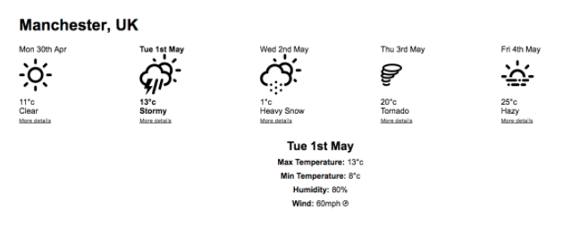
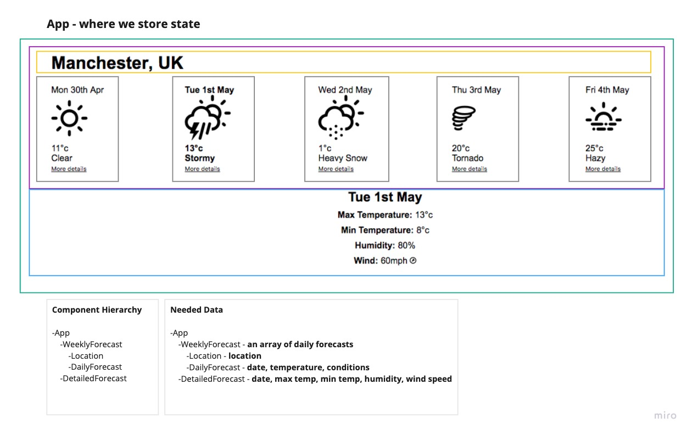

# Weather App

A bootcamp project to learn all about building React apps.

We are gong to build a weather app that looks something like the following mockup:

The first step in [Thinking in React](https://reactjs.org/docs/thinking-in-react.html) is to map out which parts of our mock will be components, give them names and decide what the component hierarchy will be. 

